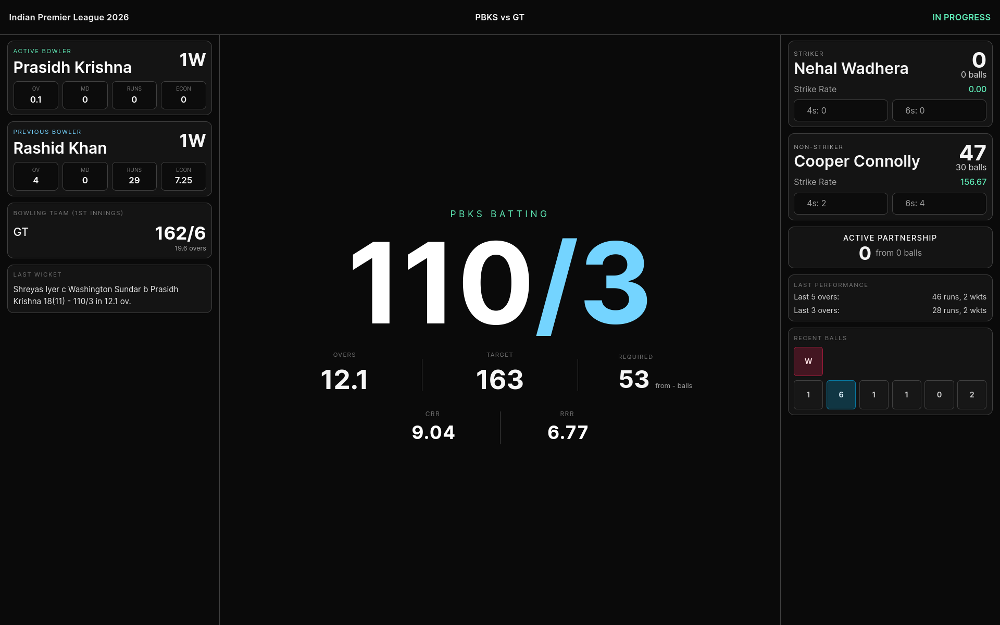
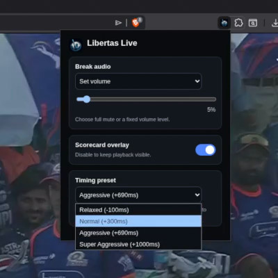
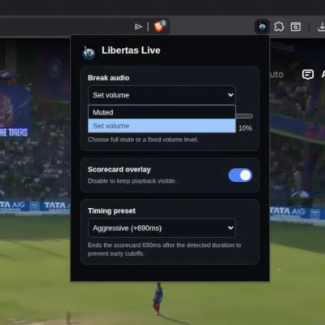

# Libertas Live 

**A better live IPL viewing experience for all.**

**[⬇️ Install for Chrome](https://chromewebstore.google.com/detail/libertas-live-a-better-ip/kohlnbhmgcnohpenglfgpmpfbihfbeif)** &nbsp;|&nbsp; **[⬇️ Install for Firefox](https://addons.mozilla.org/en-US/firefox/addon/libertas-live/)** (pending approval)

Libertas Live is a browser extension that enhances your IPL viewing experience on Hotstar by automatically detecting promotional breaks, managing audio, and replacing visual distractions with a clean, real-time scorecard overlay. Never miss a ball of the match, but skip the repetitive interruptions!

<p align="center">
  
</p>

## ✨ Features

- **Automatic Break Detection:** Intercepts specific stream events on Hotstar to know exactly when a promotional segment starts and how long it will last.
- **Live Scorecard Overlay:** Replaces the video player during breaks with a distraction-free, real-time scorecard so you never lose track of the match.
- **Smart Audio Control:** Choose to completely mute the tab during these segments or just lower the volume to a comfortable level.
- **Customizable Timing:** Adjust the synchronization aggressiveness (Relaxed, Normal, Aggressive, Super Aggressive) according to your tolerance level.



## 🚀 Installation

The easiest way to install Libertas Live is directly from your browser's extension store:
- **[Chrome Web Store](https://chromewebstore.google.com/detail/libertas-live-a-better-ip/kohlnbhmgcnohpenglfgpmpfbihfbeif)**
- **[Firefox Add-ons](https://addons.mozilla.org/en-US/firefox/addon/libertas-live/)** (pending approval)

### Manual Installation (For Developers)

Libertas Live can also be installed manually from source:

1. **Clone the repository:**
   ```bash
   git clone https://github.com/aps6/libertas-live.git
   cd libertas
   ```

2. **Load the extension in Chrome:**
   - Open your browser and navigate to `chrome://extensions/`
   - Enable **Developer mode** (toggle in the top right corner).
   - Click **Load unpacked**.
   - Select the `libertas` directory you just cloned.

## ⚙️ Configuration

Click on the Libertas extension icon in your browser toolbar to open the popup. From there, you can configure:
- **Audio Mode:** Mute entirely or reduce volume during breaks.
- **Break Volume:** Set the exact percentage for reduced volume.
- **Overlay:** Toggle the live scorecard overlay on or off.
- **Aggressiveness:** Fine-tune the timing offsets for break ends to your preference. Higher aggressiveness = less chances of ads sneaking in towards the end.

<p align="center">
  
  
</p>

## License

This project is licensed under the GNU General Public License v3.0. See `LICENSE` for details.
